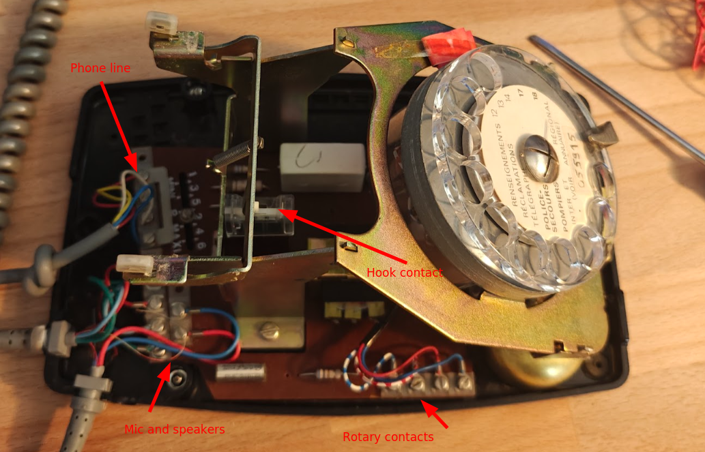

# Audio Guestbook

**WIP, but seems to be usable**

## Context

Some good friends are leaving the area and we wanted to give them a gift, an audio guest book.  
As we're french, we decided to use the famous old rotary phone made by [Socotel, the `S63`](https://fr.wikipedia.org/wiki/T%C3%A9l%C3%A9phone_S63).

Must have features are :

* Be able to use the rotary dialer to execute some actions
* Be able to leave an audio message
* Be able to use mic and speaker from the main phone as well as the secondary speaker
* Be able to make it ring as it used to (Spoiler : I didn't managed to make original bell work ... But I suggest another way to perform it) 
* Use a rgb led to provide a status to users
* Send voice messages to a telegram channel

Here are some credits I'd like to give because the authors inspired me :

* https://www.hackster.io/carolinebuttet/turn-a-rotary-phone-into-a-radio-and-travel-through-time-14fd79
* https://github.com/ThomasChappe/S63_Arduino
* https://github.com/revolunet/s63/

## Unboxing and understanding what's inside the S63

Here it is !



### The rotary dialer

The rotary dialer is composed of 2 dry contacts related to :

* Is the rotary in use ? (blue and blue/while wires)
* Pulses counter linked to the dialed number (red and red/white wires)

### Mic and speakers

I found the speaker quality good enough to listen to messages while I found the quality of the microphone very poor.  
I decided to change the micro by one from an old unsed headset I had somewhere ;)

### Phone line

This part is absolutely not necessary. I'll maybe just use wires to power the raspberry pi.

## Setup

### Hardware

| Item                         | Photo                                          | Description |
| ---------------------------- | ---------------------------------------------- | ----------- |
| Socotel S63 Phone            |           | The phone !!(bought on [le bon coin](https://leboncoin.fr)) | 
| Raspberry pi 2 W             |  | |
| USB sound card               |       | To connect mic and speaker from the main phone              |
| Jack 3,5mm adapter           |             | To connect the secondary speaker                            |
| USB hub                      |                   | To connect soundcard and ringtone                           |
| USB extender                 |         | To connect soundcard and ringtone                           |
| USB speaker for the ringtone |             | Speaker used to play ringtone                               |

### OS

I simply used rpi-imager and image `Raspberry pi OS LITE 64 bits`.  

Options set (Ctrl+Shift+X) : 

* username as guestbook
* wifi settings

### Packages

**System**

```sh
sudo apt update
sudo apt install git python3-yaml python3-pip python3-python-telegram-bot ffmpeg python3-flask
sudo apt remove python3-rpi.gpio
sudo apt install python3-rpi-lgpio
sudo pip3 install --break-system-packages gTTS gTTS-token
```

**Led status option**

There is an option to use a led (type ws2128b) to provide the guest book status.  
It's executed over a dedicated daemon because it requires root elevation to access ws2128b led.  
It publishes a mini API that will be able to control the LED.


In `config.yml`, you can set options for that led

```yaml
led:
  enabled: True
  pin: 21  # GPIO pin connected to the LED
  num_leds: 1  # Number of LEDs
  brightness: 127  # Brightness of the LED
```

Please, choose a GPIO PWM for the led.

* Systemd unit

```sh
sudo cp contrib/led-controller.service /etc/systemd/system/
sudo chmod 644 /etc/systemd/system/led-controller.service 
sudo systemctl daemon-reload
sudo systemctl enable led-controller.service
sudo systemctl start led-controller.service
```

* Testing it

```sh
curl -X POST -H "Content-Type: application/json" -d '{"color": [255, 0, 0], "blinking": false}' http://localhost:5000/led # red
curl -X POST -H "Content-Type: application/json" -d '{"color": [255, 0, 0], "blinking": true}' http://localhost:5000/led # red blinking
curl -X POST -H "Content-Type: application/json" -d '{"color": [0, 0, 255], "blinking": true}' http://localhost:5000/led # blue blinking
curl -X POST -H "Content-Type: application/json" -d '{"color": [0, 0, 0], "blinking": false}' http://localhost:5000/led # Switched off
```

* Color codes

| Color           | Description                                                     |
| --------------- | --------------------------------------------------------------- |
| Orange solid    | System is booting                                               |
| Orange blinking | System is UP but audio guestbook is not launched                |
| Green solid     | Audio guestbook is launched, you can pick up the phone          |
| Green blinking  | Hooked up, waiting for a dialed number                          |
| Blue solid      | Action is finished, ready to execute another one or to hang up  | 
| Blue blinking   | Action is executing                                             |

**Ringtone**

You can enable the ringtone option that will allow you to make the phone ring.  
It can be executed by calling a endpoint of the API or through a telegram message.

In `config.yml`, you can set options for the ringtone

```yaml
ringtone:
  enabled: True
  device_address: 'hw:0,0' 
  volume: 0.1
  sound_file: 'sounds/original_bell.wav'
```

* Testing it

**Through API**

```sh
curl -X POST -H "Content-Type: application/json" http://localhost:5001/ring # Play ringtone
curl -X POST -H "Content-Type: application/json" http://localhost:5001/stop_ring # Stop ringtone
```

**Through telegram**


**Audio guestbook itself**

Note that most of that code has been written by chatpgt.  
There might be some errors, improvements to do and so on.  
Of course, you can suggest PR to help the project !

```sh
git clone https://github.com/mmourcia/audio-guestbook.git
cd audio-guestbook
```

**Systemd unit to launch the program at start**

```sh
sudo cp contrib/audio-guestbook.service /etc/systemd/system/
sudo chmod 644 /etc/systemd/system/audio-guestbook.service 
sudo systemctl daemon-reload
sudo systemctl enable audio-guestbook.service
sudo systemctl start audio-guestbook.service
```

## Wiring

### On hook contact

The S63 is equipped with a mechanical system which opens or closes a dry contact depending on whether the handset is lifted or hung up.  
With a multimeter, I saw that it was a normally closed contact. It means that the circuit is closed when the headset is hung up.


As you can see, I sawed off a large part of the motherboard. 


I just wanted to keep the dry contact


| Pin    | Endpoint | Description     |
| ------ | -------- | --------------- |
| GPIO22 | Hook 1   | On hook contact |
| GND    | Hook 2   | |

### Rotary dialer

The rotary dialer is a piece of genius.  

A first contact can tell us the rotary dialer is being used. Wires blue and blue/white are used.  
A second one will make a pulse at each step during the rotation. Wires red and red/white are used.


| Pin    | Endpoint   | Description                               |
| ------ | ---------- | ----------------------------------------- |
| GPIO23 | Red        | Pulse counter                             |
| GND    | Red/White  | |
| GPIO18 | Blue       | Rotary enable                             |
| ??     | Blue/White | I was not obliged to wire it. Who knows ? |

### Mic and speakers

**Mic**

The microphone comes from an old headset. I just soldered both wires and glued the mic with hot glue.


**Main speakers**

I have let the speaker as it was.


**Secondary speaker**

I have let the speaker as it was.


**Solders on the sound card side**

From the sound card side : 

* I directly soldered mic and speakers wires on external terminals of jacks connectors
* I used a jack/screw adapter to connect the secondary speaker


## Test it

First, adjust settings in `config.yaml` file

```yml
rotary:
  enable_pin: 18 # rotary in use pin
  count_pin: 23 # pulse counter pin
  bounce_time: 10
  debounce_delay: 0.01

hook:
  pin: 22 # headset hook pin
  sound_file: 'sounds/on_hook.mp3'

sounds:
  greeting: 'sounds/greeting.wav'
  leave_message: 'sounds/leave_a_message.wav'

audio_output:
  device_address: 'hw:0,0'  # Change this to your desired audio output device address. curl -X GET http://localhost:5001/audio_devices|jq . 

recording:
  max_duration: 10  # Maximum duration in seconds

telegram:
  token: "YOUR_TELEGRAM_BOT_TOKEN" # if set, the program will send recorded voice to telegram. (set it to "" to disable telegram).
  chat_id: "YOUR_TELEGRAM_CHAT_ID"

led:
  enabled: True
  pin: 21  # GPIO pin connected to the LED
  num_leds: 1  # Number of LEDs
  brightness: 127  # Brightness of the LED

ringtone:
  enabled: True
  device_address: 'hw:1,0' # Change this to your desired audio output device address. curl -X GET http://localhost:5001/audio_devices|jq . 
  volume: 0.1
  sound_file: 'sounds/original_bell.wav'
```

To help you finding your audio devices, you can use a special route of the API to get it

```sh
curl -s -X GET http://localhost:5001/audio_devices|jq .
{
  "audio_devices": [
    {
      "device_address": "hw:0,0",
      "name": "UACDemoV10 [UACDemoV1.0]: USB Audio"
    },
    {
      "device_address": "hw:1,0",
      "name": "Device [USB PnP Sound Device]: USB Audio"
    },
    {
      "device_address": "hw:2,0",
      "name": "vc4hdmi [vc4-hdmi]: MAI PCM i2s-hifi-0"
    }
  ]
}
```

Execute the guestbook from the command line :

```sh
python3 main.py
```

Debug messages will appear on the tty.

Or using systemd

```sh
sudo systemctl start audio-guestbook.service
```

To get logs, use the following command :

```sh
sudo journalctl -fu audio-guestbook.service
```

Now you can try 

* to pick up the headset, you'll listen to the original dial frequency
* to dial 1, you'll listen to a recorded message
* to dial 2, you'll be able to record a message (10s max)
* to dial 3, you'll listen to the last recorded message
* to dial 4, you'll listen to a random french joke taken from blagues-api.fr

To update or add new actions, have a look at `dialed_number` directory.

Enjoy !

## Troubleshooting

**Set capture volume**

First get the name of the mixer

```
amixer
```

And then set the volume capture

```
amixer sset 'Mic' 90%
```

**Get logs**

```sh
sudo journalctl -fu audio-guestbook.service
sudo journalctl -fu led-controller.service
```

